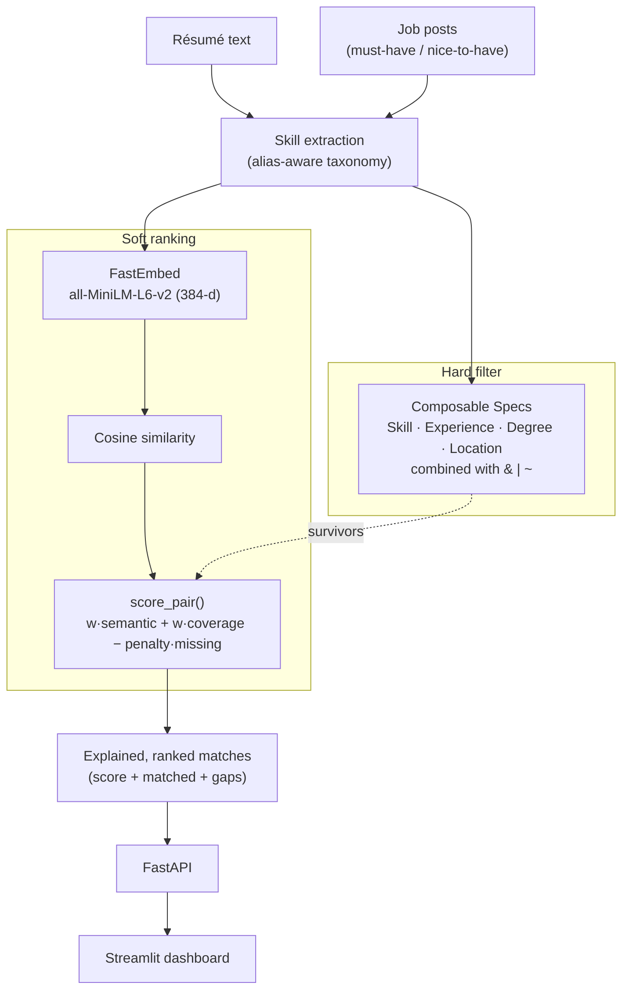

<div align="center">


</div>

# ResuMatch — Intelligent Candidate Matching

**Match résumés to jobs the way a recruiter actually reasons: hard rules first, then a nuanced ranking — and always show your work.** ResuMatch encodes every hiring criterion (must-have skills, minimum experience, degree, location) as a composable *specification* object, then ranks the survivors with a hybrid score that blends semantic similarity and skill coverage. Every result comes with the matched skills, the missing must-haves, and how each part contributed.

<div align="center">

[](https://www.python.org/)
[](https://fastapi.tiangolo.com/)
[](https://pytest.org/)
[](https://opensource.org/licenses/MIT)

</div>

---

## The problem

Hiring criteria are messy and layered: "must know Python and SQL, 5+ years, and *either* a Master's *or* open to remote." Hard-coding that as nested `if` statements produces logic that is impossible to test, reuse, or audit — and it breaks every time a role's requirements change. Meanwhile, a pure keyword filter throws away good candidates who phrased things differently, and a pure embedding similarity score can't express a non-negotiable "must-have."

ResuMatch keeps the two concerns separate. **Hard requirements** are composable predicates you can combine with `&`, `|`, and `~`. **Soft fit** is a transparent ranking score. Nothing about a match is a black box — which matters when the output influences who gets an interview.

## What it does

- Extracts a canonical skill set from free-text résumés and job descriptions using an alias-aware, word-boundary-safe taxonomy.
- Expresses each hiring rule as a reusable `Spec` object and composes rules with Python operators.
- Ranks candidates for a job (or jobs for a résumé) with a hybrid semantic + skill-coverage score.
- Explains every ranking: matched skills, missing must-haves, and the semantic vs. skill contributions.
- Serves it all over a small FastAPI service with a Streamlit dashboard on top.

## How it works

Two layers, deliberately decoupled. Specifications are **hard filters** (a candidate either satisfies the rule or doesn't); the ranker is the **soft scorer** that orders whoever passes.



## The Specification Pattern

Each hiring criterion is a first-class object exposing `is_satisfied_by(candidate) -> bool` and an `explain(candidate)` that states its verdict. Specs compose through operator overloading (`__and__`, `__or__`, `__invert__`), so complex policy reads like the sentence a recruiter would say:

```python
from resumatch.specs import SkillSpec, ExperienceSpec, DegreeSpec, LocationSpec

python_sql   = SkillSpec({"python", "sql"})          # 100% coverage by default
senior       = ExperienceSpec(min_years=5)
masters      = DegreeSpec("masters")
sf_or_remote = LocationSpec({"San Francisco"}, accept_remote=True)

# "Python + SQL, senior, and (Master's OR SF/remote)"
spec = python_sql & senior & (masters | sf_or_remote)

qualified = [c for c in candidates if spec.is_satisfied_by(c)]
print(python_sql.explain(candidate))
# SkillSpec(FAIL): matched=['python'], missing=['sql'], threshold=100%
```

Or build the whole composite from a structured job requirement in one call:

```python
from resumatch.specs import from_job_requirements

spec = from_job_requirements(
    must_have_skills=["python", "pytorch"],
    min_years=3,
    min_degree="bachelors",
    locations=["San Francisco", "New York"],
    accept_remote=True,
)
```

### The predicate hierarchy

| Spec | Reads from candidate | Rule |
|---|---|---|
| `SkillSpec` | `extracted_skills` | Coverage of required skills ≥ `match_threshold` (default 1.0) |
| `ExperienceSpec` | `years_experience` | `≥ min_years` |
| `DegreeSpec` | `degree` | Ordinal hierarchy: `none < associate < bachelors < masters < phd` |
| `LocationSpec` | `location`, `remote` | City match, or remote bypass when `accept_remote` |
| `_AndSpec` / `_OrSpec` / `_NotSpec` | — | Composites from `&` / `\|` / `~`; each `explain()` composes too |

Adding a new criterion means writing one small class — no existing spec changes, and it's independently unit-testable.

## The ranking score

Candidates that pass the specs are ordered by a hybrid score computed in `matching/rank.py`:

$$\text{score} = w_{\text{sem}} \cdot \cos(\mathbf{v}_{\text{resume}}, \mathbf{v}_{\text{job}}) + w_{\text{skill}} \cdot \frac{|\text{matched}|}{|\text{must} \cup \text{nice}|} - \lambda \cdot |\text{missing must-haves}|$$

| Parameter | Default (`configs/config.yaml`) | Meaning |
|---|---|---|
| $w_{\text{sem}}$ | `0.45` | Semantic similarity weight |
| $w_{\text{skill}}$ | `0.55` | Skill-coverage weight |
| $\lambda$ | `0.15` | Penalty per missing must-have skill |
| `top_k` | `10` | Results returned |

Semantic vectors come from `sentence-transformers/all-MiniLM-L6-v2` served by [FastEmbed](https://github.com/qdrant/fastembed) (384-d, L2-normalised, cosine via dot product). The skill taxonomy is **data, not code** — a real deployment can swap in ESCO/O\*NET without touching the matcher.

## Getting started

```bash
make install                        # uv sync --group dev
uv run python scripts/make_talent.py  # generate the synthetic talent pool + jobs
make test                           # run the suite

make api                            # FastAPI on http://localhost:8130
make ui                             # Streamlit dashboard on http://localhost:8631
```

Generate the data first: the API and UI read `data/processed/*.parquet`, and endpoints return `503` (with a hint to run `scripts/make_talent.py`) until it exists.

Or with Docker:

```bash
make docker-up                      # docker compose up --build -d  (API :8130, UI :8631)
make docker-down
```

## API

| Method | Route | Purpose |
|---|---|---|
| `GET` | `/health` | Liveness check |
| `GET` | `/jobs` | List the synthetic job posts (must-have / nice-to-have skills) |
| `GET` | `/rank/{job_id}` | Rank candidates for a job, each with score, matched skills, and missing must-haves |
| `POST` | `/match` | Rank jobs for a pasted résumé; also returns the extracted skills |

```bash
curl -X POST http://localhost:8130/match \
  -H "Content-Type: application/json" \
  -d '{"resume": "Five years with python, sql and docker. Shipped ML pipelines with scikit-learn on AWS.", "top_k": 5}'
```

*Illustrative output shape on synthetic data (not a benchmark):*

```json
{
  "extracted_skills": ["aws", "docker", "machine learning", "python", "sql"],
  "jobs": [
    {"job_id": 1, "title": "backend engineer #1", "score": 0.71,
     "semantic": 0.42, "skill_coverage": 0.83,
     "matched_skills": ["python", "sql", "docker", "aws"],
     "missing_must_haves": []}
  ]
}
```

## Evaluation

There are no benchmark numbers to quote here, by design. `scripts/make_talent.py` generates a synthetic pool of candidates and jobs with **known ground truth**: each candidate is drawn from a "home role", and their ideal-fit jobs are the ones whose must-have skills they cover. Because the ground truth is generated, quality is checked directly by the test suite rather than by hand-tuned metrics:

- `test_matching.py::test_rank_candidates_prefers_home_role` — the ranker surfaces candidates whose home role matches the job.
- `test_matching.py::test_rank_jobs_finds_matching_role` — a résumé is matched back to jobs in its own role.
- `test_matching.py::test_rankings_are_sorted_and_explained` — results are ordered and carry their explanation fields.

Reproduce:

```bash
uv run python scripts/make_talent.py
uv run pytest tests/test_matching.py -v
```

Any absolute score depends on the generated dataset, the seed (`42`), and the weights in `configs/config.yaml`; run the above to produce numbers for your configuration.

## Testing

```bash
make test        # uv run pytest --cov
```

- `test_specs.py` — the Specification Pattern: leaf specs, `& | ~` combinators, the `from_job_requirements` factory, and `explain()`.
- `test_matching.py` — skill extraction, `score_pair` penalties, and ranking behaviour against the synthetic ground truth.
- `test_api.py` — HTTP contract tests for the four endpoints (including `404` on unknown job and validation on short résumés).

## Limitations

- Skill extraction is only as good as the taxonomy in `skills/taxonomy.py` — skills or aliases it doesn't list are invisible to both the specs and the coverage score.
- `ExperienceSpec`, `DegreeSpec`, and `LocationSpec` need structured candidate fields (`years_experience`, `degree`, `location`, `remote`); the bundled synthetic résumés don't populate all of these, so those specs are demonstrated in tests rather than wired into the API pipeline.
- The bundled data is synthetic; the taxonomy and score weights would need recalibration on real résumé/job distributions.
- Embeddings are a general-purpose sentence model, not fine-tuned on hiring text.

## Project structure

```
src/resumatch/
├── specs/       # Specification Pattern — composable hiring predicates (the core)
├── matching/    # Hybrid ranking: embeddings, cosine, score_pair, rank_candidates/rank_jobs
├── skills/      # Alias-aware skill taxonomy + extraction
├── api/         # FastAPI app factory (main:app) and routes
├── ui/          # Streamlit dashboard
└── settings.py  # Env + configs/config.yaml loader
scripts/
└── make_talent.py   # Synthetic talent pool + jobs with known ground truth
```

## License

MIT

---

<div align="center">

**Jackson Marcus** · Senior AI & Machine Learning Engineer

[](https://github.com/jackson-marcus)
[](mailto:wajahatanees41@gmail.com)

</div>
