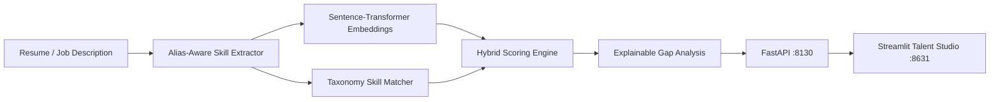

# ResuMatch — Semantic Talent Matching & Resume Intelligence

<div align="center">

[](https://www.python.org/)
[](https://fastapi.tiangolo.com/)
[](https://streamlit.io/)
[](https://mlflow.org/)
[](https://www.docker.com/)
[](https://github.com/astral-sh/ruff)
[](https://pytest.org/)
[](https://opensource.org/licenses/MIT)

</div>

> **Explainable talent matching platform combining alias-aware technical skill ontology extraction, hybrid dense-semantic plus hard-skill scoring, and actionable candidate gap analysis.**

---

## 📖 Executive Summary & Value Proposition

**`resumatch`** is a production-grade, end-to-end machine learning system built with strict engineering discipline, reproducible pipelines, and enterprise MLOps best practices. It bridges the gap between theoretical statistical rigor and high-availability operational microservices.

## 👥 Core Methodologies & Matching Architecture

### 1. Alias-Aware Skill Ontology Extraction
- Rule and synonym dictionary resolving non-standard terminology (e.g. *k8s* $	o$ *Kubernetes*, *Postgres* $	o$ *PostgreSQL*, *AWS* $	o$ *Amazon Web Services*).

### 2. Hybrid Semantic-Skill Matching Formula
- Blends dense vector embedding similarity with exact hard-skill taxonomy overlap:
$$	ext{Match Score} = lpha \cdot 	ext{CosineSim}(\mathbf{v}_{	ext{resume}}, \mathbf{v}_{	ext{job}}) + (1 - lpha) \cdot 	ext{Jaccard}(	ext{Skills}_{	ext{candidate}}, 	ext{Skills}_{	ext{required}})$$

### 3. Explainable Gap Analysis
- Generates structured recruiter scorecards highlighting matched essential skills, missing required qualifications, and experience level alignment.

## 📊 Architecture & Pipeline



## 🛠️ Tech Stack & Engineering Standards
- **NLP & Matching:** Python 3.12, NumPy, SciPy, Sentence-Transformers, SpaCy
- **Serving & UI:** FastAPI, Streamlit, MLflow
- **Testing:** Pytest coverage across skill parsing, hybrid matching weights, and gap analysis


---

## 🚀 Quickstart & Setup Guide

### 1. Prerequisites & Environment Setup
Using **[uv](https://docs.astral.sh/uv/)** for lightning-fast, reproducible dependency resolution:

```bash
# Clone the repository
git clone https://github.com/jackson-marcus/resumatch.git
cd resumatch

# Install dependencies and pre-commit hooks
uv sync --group dev
```

### 2. Run Test Suite & Code Quality Checks
```bash
# Run unit & integration tests with coverage
uv run pytest --cov

# Run ruff linter and formatting checks
uv run ruff check .
uv run ruff format --check .
```

### 3. Launch Services Locally
```bash
# Start FastAPI REST API (listening on port :8130)
make api
# Or: uv run uvicorn resumatch.api.main:app --reload --port 8130

# Start interactive Streamlit dashboard (listening on port :8631)
make ui

# Launch local MLflow Experiment Tracking UI (listening on port :5014)
make mlflow
```

### 4. Run with Docker Compose
```bash
# Spin up the complete microservice stack
docker compose up --build
```

---

## 📂 Repository Layout

```
resumatch/
├── .github/workflows/ci.yml       # GitHub Actions CI pipeline (lint, test, build)
├── configs/                      # Configuration files and hyperparameters
├── data/                         # Data directory (raw, interim, processed)
├── scripts/                      # Data generators and operational scripts
├── src/resumatch/               # Core Python package
│   ├── api/                      # FastAPI routes, schemas, and endpoints
│   ├── models/                   # Statistical models, ML algorithms, and estimators
│   ├── ui/                       # Streamlit interactive application
│   └── settings.py               # Centralized configuration & environment loader
├── tests/                        # Comprehensive Pytest suite
├── docker-compose.yml            # Multi-service container orchestration
├── Dockerfile                    # Container definition for API service
├── Makefile                      # Standardized project tasks
└── pyproject.toml                # Pinned dependencies and tool configs
```

---

## 👤 Author & Contact

**Jackson Marcus**
- **Email:** [jackson.marcus.work@gmail.com](mailto:jackson.marcus.work@gmail.com)
- **Upwork:** [Jackson Marcus on Upwork](https://www.upwork.com/freelancers/~012235717501ad9c7b)
- **GitHub:** [@jackson-marcus](https://github.com/jackson-marcus)

*Available for machine learning engineering, MLOps, data science, and AI system architecture consulting and contract engagements.*

